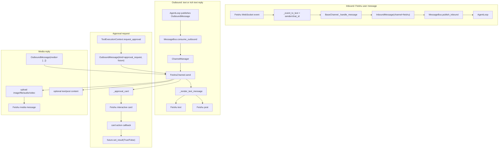
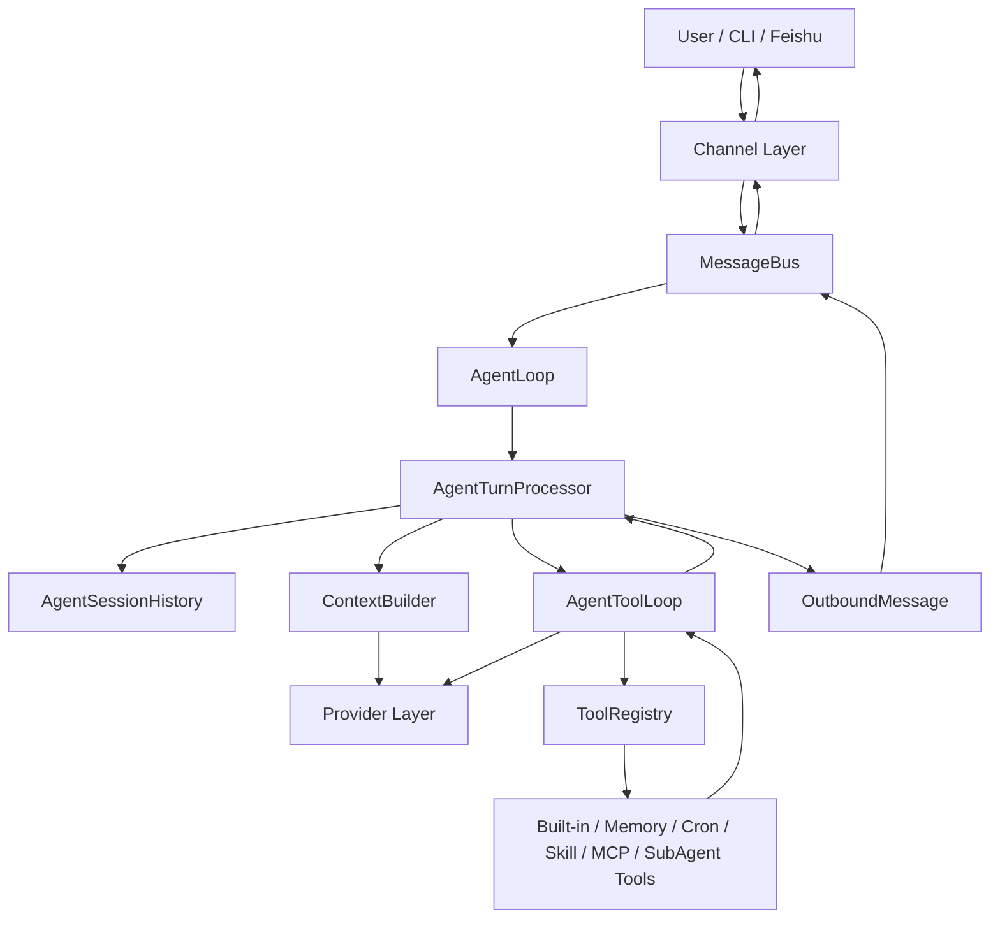

# MyAgent Architecture Walkthrough

This document records the step-by-step architecture walkthrough for MyAgent.
It is meant for future readers, interview preparation, and conversation
continuity. When a new architecture topic is explained, update this file with
what was covered and where to continue next.

## Purpose

MyAgent is a local-first, lightweight agent runtime for learning, personal
assistant experiments, and interview explanation. The current architecture
prioritizes:

- A clear main runtime path.
- Small modules with explicit responsibilities.
- Message history that represents real conversation state.
- Dynamic context assembly before each model call.
- Tool execution through a registry rather than hard-coded branching.
- Simple long-context management through raw history, summary, and memory.

## Main Runtime Path

The high-level flow is:

```text
Channel
  -> InboundMessage
  -> MessageBus
  -> AgentLoop
  -> AgentTurnProcessor
  -> AgentSessionHistory
  -> ContextBuilder
  -> ToolLoop
  -> Provider
  -> ToolRegistry, if tool calls are returned
  -> OutboundMessage
  -> MessageBus
  -> Channel
```

The most important mental model is:

```text
History stores completed conversation messages.
ContextBuilder builds the current model input.
ToolLoop runs one model/tool/final-answer turn.
ToolRegistry owns tool lookup, validation, and execution.
```

## Covered Topics

### 1. InboundMessage and Session Identity

Status: covered.

Key idea:

- External channels convert user input into `InboundMessage`.
- A session is identified by channel/chat identity, so CLI and Feishu can keep
  separate conversation histories.
- Cron jobs reuse saved channel/chat routing information so scheduled messages
  can return to the original conversation.

Files:

- `myagent/bus/events.py`
- `myagent/agent/runtime/turn_processor.py`
- `myagent/agent/cron_bridge.py`

### 2. History vs System Prompt

Status: covered.

Key idea:

- Raw history stores real conversation messages: `user`, `assistant`, and
  `tool`.
- The full system prompt is not written back into history.
- The system prompt is rebuilt each turn from identity, runtime environment,
  memory, conversation summary, skills, and profile data.

Why this matters:

- Avoids repeated system prompt bloat.
- Prevents memory and summary from being polluted by old system prompt copies.
- Keeps history as a clean record of completed user/assistant/tool interaction.

Files:

- `myagent/agent/runtime/turn_processor.py`
- `myagent/agent/runtime/tool_loop.py`
- `myagent/agent/runtime/messages.py`
- `myagent/agent/context/builder.py`

### 3. ContextBuilder

Status: covered.

Key idea:

- `ContextBuilder` does not store history.
- `ContextBuilder` does not compress history.
- It builds the messages for one provider call:

```python
[
    {"role": "system", "content": system_prompt},
    *history,
    {"role": "user", "content": current_message.content},
]
```

The system prompt is rendered from ordered `ContextSection` values such as:

- `Identity`
- `Agent Instructions`
- `User Profile`
- `Runtime Environment`
- `Delegation Policy`
- `Always Memory`
- `Now Memory`
- `Conversation Summary`
- `Active Skills`
- `Available Skills`

Files:

- `myagent/agent/context/builder.py`
- `myagent/agent/context/sections.py`
- `myagent/agent/context/types.py`

### 4. Context Runtime Wiring

Status: covered.

Key idea:

- `AgentContextRuntime` wires together context-related collaborators.
- It gives `ContextBuilder` provider functions for memory, summary, active
  skills, runtime environment, and profile data.
- This keeps `ContextBuilder` focused on assembly instead of storage.

Files:

- `myagent/agent/context/runtime.py`
- `myagent/memory/services.py`
- `myagent/agent/runtime/session_history.py`
- `myagent/agent/runtime/skill_state.py`

### 5. History Compression, Summary, and Memory

Status: covered.

Key idea:

- Before context is built, `AgentSessionHistory.compact_before_context()`
  checks whether raw history exceeds the configured budget.
- If raw history is too large, older messages are folded into conversation
  summary.
- Before old messages are pruned from raw history, memory extraction gets a
  chance to preserve future-useful facts.
- Recent messages remain as raw messages so the model can still see exact
  short-term context.

Current default budget shape:

```text
raw_history_token_limit: 128000
raw_history_target_tokens: 80000
summary_token_limit: 8000
memory_token_limit: 16000
keep_recent_messages: 40
```

Files:

- `myagent/budget.py`
- `myagent/agent/runtime/session_history.py`
- `myagent/agent/context/summary.py`
- `myagent/memory/extractor.py`
- `myagent/memory/compressor.py`

### 6. Tool Registry

Status: covered.

Key idea:

- `ToolRegistry` is the tool lookup and execution boundary.
- The model returns a tool name and arguments.
- `ToolRegistry` resolves the name, casts parameters, validates parameters, and
  calls the concrete tool.

Runtime dependency direction:

```text
ToolLoop
  -> ToolRegistry.execute(name, arguments, context)
  -> concrete Tool.execute(...)
```

This keeps `ToolLoop` from knowing about every concrete tool class.

Files:

- `myagent/tools/registry.py`
- `myagent/tools/base.py`
- `myagent/tools/__init__.py`
- `myagent/agent/runtime/tool_loop.py`

### 7. Tool Registration Boundaries

Status: covered.

Key idea:

```text
The module that owns a tool's dependencies should register that tool.
```

`create_default_registry()` only registers first-stage built-in tools that are
mostly stateless or only need the workspace root:

- filesystem tools
- attachment tool
- web search/fetch tools
- shell command tool

Runtime-owned or integration-owned tools are registered elsewhere:

- Memory tools are registered by `AgentMemoryServices`.
- Skill tools are registered by `AgentContextRuntime`.
- Cron is registered only when a real `CronService` is injected.
- `delegate_task` is registered when the main agent has a provider and parent
  registry.
- MCP tools are registered after external MCP servers connect and report their
  available tools.

Files:

- `myagent/tools/__init__.py`
- `myagent/agent/loop.py`
- `myagent/memory/services.py`
- `myagent/agent/context/runtime.py`
- `myagent/cli/runtime.py`
- `myagent/mcp/registry.py`

### 8. ToolExecutionContext

Status: covered.

Key idea:

- Tool schemas describe model-provided arguments.
- `ToolExecutionContext` carries runtime-provided information for the current
  turn.
- The registry injects this context into concrete tool execution as `_context`.

Runtime context currently includes:

- `session_key`
- `turn_id`
- `channel`
- `chat_id`
- `approval_callback`
- shared turn `attachments`

This keeps internal runtime state out of model-facing tool schemas while still
letting tools ask for approval, route cron jobs back to the originating chat,
or attach files to the final reply.

Files:

- `myagent/tools/context.py`
- `myagent/tools/registry.py`
- `myagent/agent/runtime/tool_loop.py`
- `myagent/tools/cron.py`
- `myagent/tools/attachments.py`
- `myagent/tools/shell.py`
- `myagent/tools/filesystem.py`

### 9. Provider Layer

Status: covered.

Key idea:

- The runtime should not depend on raw SDK response objects.
- Providers normalize backend responses into `ProviderResponse`.
- Tool-capable responses are represented by `ToolCall`.

The runtime-facing provider contract is:

```text
generate(messages) -> str
generate_response(messages, tools=None) -> ProviderResponse
```

`generate()` is the simple text-only path.
`generate_response()` is the structured path used by `ToolLoop`.

Files:

- `myagent/providers/base.py`
- `myagent/providers/openai_compatible.py`
- `myagent/providers/echo.py`
- `myagent/providers/__init__.py`

### 10. MCP Adapter Internals

Status: covered.

Key idea:

- MCP servers expose external tool definitions.
- MyAgent wraps each MCP tool in `McpToolAdapter`.
- `McpToolAdapter` implements the normal internal `Tool` contract.
- After registration, `ToolLoop` and `ToolRegistry` do not need to know whether
  a tool is local or MCP-backed.

Runtime shape:

```text
MCP server tool definition
  -> McpToolDefinition
  -> McpToolAdapter
  -> ToolRegistry.register(adapter)
  -> ToolLoop executes it like any other Tool
  -> adapter calls client.call_tool(original_mcp_name, arguments)
```

Files:

- `myagent/mcp/types.py`
- `myagent/mcp/adapter.py`
- `myagent/mcp/registry.py`
- `myagent/cli/runtime.py`
- `tests/test_mcp_registry.py`

### 11. Channel Layer and MessageBus Delivery

Status: covered.

Key idea:

- Channels adapt external platforms to MyAgent's internal message model.
- `MessageBus` decouples channels from `AgentLoop`.
- `AgentLoop` consumes `InboundMessage` and publishes `OutboundMessage`.
- Channels decide how to render and deliver outbound messages for their
  platform.

Runtime shape:

```text
External user/platform event
  -> Channel adapter
  -> InboundMessage
  -> MessageBus.publish_inbound
  -> AgentLoop consumes inbound
  -> AgentLoop publishes OutboundMessage
  -> MessageBus.consume_outbound
  -> ChannelManager routes by msg.channel
  -> Channel sends platform-specific response
```

Files:

- `myagent/bus/events.py`
- `myagent/bus/queue.py`
- `myagent/channels/base.py`
- `myagent/channels/manager.py`
- `myagent/cli/commands.py`
- `myagent/channels/feishu.py`

### 12. Configuration and Runtime Assembly

Status: covered.

Key idea:

- Entry points should not manually assemble every dependency inline.
- `Settings` loads config/env values.
- `create_agent_runtime()` builds the shared provider/tool/MCP/cron/agent
  runtime used by CLI and gateway modes.
- CLI mode and gateway mode differ mainly in how channels are started and
  whether cron starts automatically.

Runtime assembly shape:

```text
Settings.from_sources()
  -> MessageBus()
  -> create_default_registry(workspace_root)
  -> connect_mcp_servers(settings, registry)
  -> create_cron_service(bus)
  -> create_provider(settings)
  -> AgentLoop(...)
  -> AgentRuntime(agent, registry, mcp_clients)
```

Files:

- `myagent/__main__.py`
- `myagent/cli/commands.py`
- `myagent/cli/runtime.py`
- `myagent/config/settings.py`
- `myagent/agent/loop.py`

### 13. Feishu Rendering, Approval Cards, and Media

Status: covered.

Key idea:

- Feishu is a channel adapter, not part of agent reasoning.
- It translates `OutboundMessage` into Feishu-specific message types.
- Approval requests become interactive cards.
- Markdown-ish text becomes either plain `text` or Feishu `post`.
- `OutboundMessage.media` files are uploaded and sent before text content.

Outbound handling shape:

```text
OutboundMessage
  -> metadata.kind == approval_request ? interactive card
  -> media files ? upload image/file/audio/video
  -> content ? render text or post
  -> Feishu HTTP send API
```

Inbound handling shape:

```text
Feishu WebSocket event
  -> extract text, sender, chat_id
  -> BaseChannel._handle_message(...)
  -> InboundMessage
  -> MessageBus
```

Files:

- `myagent/channels/feishu.py`
- `myagent/channels/feishu_rendering.py`
- `tests/test_channels_feishu.py`

### 14. Testing and Verification Strategy

Status: current topic.

Key idea:

- The project uses focused tests around module boundaries.
- Core runtime behavior is tested with fake providers, fake clients, and local
  test workspaces.
- External services are not required for normal automated verification.
- Full test suite is the final safety net after focused tests pass.

Focused verification map:

```text
Agent runtime:
  tests/test_agent_loop.py

Context:
  tests/test_context_builder.py
  tests/test_agent_loop.py

Memory:
  tests/test_agent_memory.py
  tests/test_memory_tools.py
  tests/test_memory_consolidator.py
  tests/test_memory_compressor.py

Tools:
  tests/test_tool_registry.py
  tests/test_filesystem_tools.py
  tests/test_shell_tool.py
  tests/test_web_tool.py

Channels:
  tests/test_cli_channel.py
  tests/test_channels_base.py
  tests/test_channels_manager.py
  tests/test_channels_feishu.py

MCP:
  tests/test_mcp_config.py
  tests/test_mcp_adapter.py
  tests/test_mcp_registry.py
  tests/test_mcp_stdio.py
  tests/test_mcp_http.py

Cron:
  tests/test_cron_store.py
  tests/test_cron_service.py
  tests/test_cron_tool.py
  tests/test_cron_bridge.py

Provider:
  tests/test_llm_provider.py

Skills/Subagent/Profile:
  tests/test_skills.py
  tests/test_skill_tools.py
  tests/test_agent_skills.py
  tests/test_subagent.py
  tests/test_profile.py
```

Final verification:

```text
python -m compileall -q myagent
python -m pytest
```

## Current Chapter Notes

### ToolRegistry Responsibilities

`ToolRegistry` owns:

- Registration and replacement of tools.
- Tool schema exposure for provider calls.
- Tool lookup by name.
- First-stage parameter casting.
- First-stage parameter validation.
- Execution with optional `ToolExecutionContext`.

It intentionally does not own:

- Model decision-making.
- Provider API calls.
- Per-tool business logic.
- Channel-specific formatting.

### Tool Base Contract

Every model-facing tool follows the same minimal contract:

```text
name
description
parameters
execute(...)
```

This contract lets the runtime expose tools to OpenAI-compatible providers as
function schemas while keeping concrete tool behavior inside each tool module.

### Tool Registration Boundary

There are two broad classes of tools.

First, default built-in tools:

```text
list_dir
read_file
write_file
edit_file
copy_file
move_file
attach_file
web_search
web_fetch
execute_command
```

These are registered by `create_default_registry()` because they mainly need a
workspace root or no runtime state.

Second, module-owned tools:

```text
memory_*
skill_get
cron
delegate_task
mcp_*
```

These need real runtime collaborators, so they are registered by the module that
owns those collaborators. This prevents `create_default_registry()` from turning
into a large application factory that knows about memory stores, cron services,
skills, providers, subagents, and external MCP clients.

### ToolExecutionContext Boundary

`ToolExecutionContext` is the per-turn runtime envelope passed to tools that
need services or routing data. It is not part of the LLM-facing JSON schema.

Examples:

- `cron` uses `channel` and `chat_id` so scheduled messages can return to the
  conversation that created the job.
- `attach_file` appends file paths to the current turn state's attachment list,
  which becomes `OutboundMessage.media` on the final answer.
- `shell` and mutating filesystem tools use `approval_callback` through
  `request_approval()` so the current channel can approve or deny risky work.

The key boundary is:

```text
LLM arguments: what the model requested.
ToolExecutionContext: what the runtime knows about this turn.
```

### Provider Normalization Boundary

`BaseProvider` defines the interface that the agent runtime consumes. Concrete
providers can talk to OpenAI-compatible APIs, fake local providers, or future
backends, but the runtime only sees:

```text
ProviderResponse(
    content: str,
    tool_calls: list[ToolCall],
    extra_message_fields: dict[str, object],
)
```

`ToolCall` is intentionally small:

```text
id
name
arguments
```

This keeps provider-specific SDK objects out of `ToolLoop`. It also lets the
runtime preserve provider-specific assistant fields, such as `reasoning_content`,
without hard-coding them into the core message model.

### MCP Adapter Boundary

MCP integration uses the adapter pattern. The remote MCP server owns the real
tool implementation, but MyAgent exposes a local wrapper that satisfies the
same `Tool` interface as built-in tools.

`McpToolAdapter` maps:

```text
Tool.name        -> safe prefixed MCP tool name
Tool.description -> MCP description plus server source
Tool.parameters  -> MCP input schema
Tool.execute     -> client.call_tool(original_mcp_tool_name, kwargs)
```

Tool names are prefixed and normalized:

```text
server: github
tool: Search Issues
registered name: mcp_github_search_issues
```

This prevents collisions with built-in tools and with tools from other MCP
servers. Filtering can match either the original MCP name or the registered
MyAgent name.

### Channel Boundary

The channel layer owns platform-specific input/output details. The agent runtime
only sees:

```text
InboundMessage(channel, sender_id, chat_id, content, metadata)
OutboundMessage(channel, chat_id, content, metadata, media)
```

The `MessageBus` is two async queues:

```text
inbound:  Channel -> AgentLoop
outbound: AgentLoop -> Channel
```

CLI and Feishu share the same internal message model even though their external
transport is very different:

- CLI reads terminal input and prints/renders terminal output.
- Feishu receives WebSocket events, sends HTTP messages, uploads media, and
  renders approval cards.

`ChannelManager` consumes outbound messages and routes them to the channel named
by `OutboundMessage.channel`.

### Runtime Assembly Boundary

Runtime assembly is split so CLI and gateway modes can share the same agent core.

`Settings` owns configuration loading:

```text
myagent.json
environment variables
defaults
```

`create_agent_runtime()` owns common runtime construction:

```text
default registry
MCP clients and MCP tool registration
cron service
provider
AgentLoop
```

CLI mode starts:

```text
AgentLoop.run_until_stopped()
run_chat()
```

Gateway mode starts:

```text
AgentLoop.run_until_stopped()
ChannelManager.start_all()
CronService through AgentLoop
```

This keeps CLI and Feishu/gateway behavior on the same runtime path instead of
creating two separate agents.

### Feishu Channel Boundary

Feishu-specific code owns platform rendering and delivery details:

- WebSocket event parsing.
- Tenant access token refresh.
- Text/post message rendering.
- Interactive approval card rendering.
- Image/file/audio/video upload.
- Card-action callbacks that resolve pending approval futures.

The agent core still only publishes `OutboundMessage`. The Feishu channel
decides how that message becomes Feishu API calls.

Feishu call scenarios:



```text
Inbound user text:
  Feishu WebSocket event -> _event_to_text -> BaseChannel._handle_message
  -> InboundMessage(channel="feishu", sender_id, chat_id, content)

Plain final reply:
  OutboundMessage(content="short text")
  -> FeishuChannel.send
  -> _render_text_message returns ("text", {"text": ...})
  -> im/v1/messages

Markdown-ish final reply:
  OutboundMessage(content="# Title\n\n- item")
  -> _render_text_message returns ("post", post_content)
  -> _markdown_to_post_content
  -> im/v1/messages

Approval request:
  OutboundMessage(metadata.kind="approval_request", future=...)
  -> _send_approval_request
  -> _approval_card
  -> Feishu interactive message
  -> card action callback resolves the future

Media reply:
  OutboundMessage(media=[...], content="optional text")
  -> upload image/file/audio/video
  -> send media message(s)
  -> render and send optional text
```

### Testing Boundary

Tests are organized around architecture boundaries rather than only individual
functions. The normal refactor workflow should be:

```text
Run focused tests for the touched module.
Run nearby integration tests if the module is on the main runtime path.
Run compileall for syntax/import safety.
Run full pytest before reporting the work as ready.
```

Examples:

```text
Changing ToolLoop:
  python -m pytest tests/test_agent_loop.py tests/test_tool_registry.py

Changing ContextBuilder:
  python -m pytest tests/test_context_builder.py tests/test_agent_loop.py

Changing Feishu:
  python -m pytest tests/test_channels_feishu.py tests/test_channels_manager.py

Changing MCP:
  python -m pytest tests/test_mcp_config.py tests/test_mcp_adapter.py tests/test_mcp_registry.py

Changing Memory:
  python -m pytest tests/test_agent_memory.py tests/test_memory_tools.py tests/test_memory_consolidator.py tests/test_memory_compressor.py
```

## Next Topics

Continue from the architecture walkthrough audit below. Do not repeat topics
listed as covered unless the user asks for a recap.

1. Explain the provider layer:
   `BaseProvider`, `ProviderResponse`, `ToolCall`, and how OpenAI-compatible
   responses are normalized for the runtime.
2. Explain MCP adapter internals:
   how external MCP tools become regular MyAgent `Tool` objects.
3. Explain channel/message delivery:
   how CLI and Feishu convert external input/output to `InboundMessage` and
   `OutboundMessage`.

Deferred unless asked:

- Shell/filesystem approval boundaries.
- Attachment flow.
- ToolExecutionContext basics.
- ContextBuilder basics.
- History compression boundary.
- ToolLoop basic execution loop.

## Walkthrough Audit 2026-05-23

The active Codex session transcript was found at:

```text
C:\Users\Lin\.codex\sessions\2026\05\20\rollout-2026-05-20T15-55-28-019e4461-ea99-73c3-9a5f-39e08efde545.jsonl
```

Recent relevant transcript lines reviewed:

- Around line `5906`: pre-prompt organization, visible memory compression, and
  `compact_before_context`.
- Around lines `5923-5972`: `ContextBuilder.build_messages`,
  `build_sections`, and messages entering `ToolLoop`.
- Around lines `5982-6002`: `ToolLoop`, `ToolRegistry`, and `_context`.
- Around lines `6073-6095`: Codex approval comparison and MyAgent shell risk
  classification.
- Around lines `6105-6125`: tool result returning to the model, final reply,
  and history writeback.
- Around lines `6132-6291`: tool result persistence research and implementation.
- Around lines `6298-6508`: budget research, tuning, system prompt not being
  saved to history, and commit `73f3331`.
- Around lines `6518-6598`: repeated ContextBuilder/history compression recap.
- Around lines `6637-6719`: `ToolRegistry` and tool registration boundaries.
- Around lines `6729-6744`: repeated `ToolExecutionContext` recap.

### Covered Enough

These topics have already been explained in the chat and should not be repeated
as the next mainline topic:

- `InboundMessage`, session identity, and why channel/chat IDs matter.
- Cron routing back to the original channel/chat.
- History vs system prompt.
- ContextBuilder message assembly.
- `ContextSectionBuilder` and system prompt sections.
- Context runtime provider wiring.
- Visible memory compression before context build.
- Raw history compression and conversation summary.
- Memory extraction before old history is pruned.
- ToolLoop's provider/tool/final-answer cycle.
- Tool result persistence into session history, including truncation.
- Budget defaults and why they were changed.
- `ToolRegistry` as lookup/schema/validation/execution boundary.
- Tool registration boundaries:
  default tools, memory tools, skill tools, cron, delegate, MCP.
- `ToolExecutionContext` as runtime-provided context.
- Shell approval comparison with Codex.
- MyAgent shell risk classification at a high level.
- `attach_file` at a high level: file paths are recorded on turn state and sent
  as final `OutboundMessage.media`.

### Partly Covered

These topics were mentioned, but not fully walked through from code to runtime:

- MCP adapter internals:
  registration was covered, but not how `McpToolAdapter` implements the `Tool`
  contract and calls the remote MCP client.
- Provider normalization:
  the main path has used provider calls, but the provider layer itself has not
  been explained as an architecture chapter.
- Channel/message delivery:
  message structs were discussed, but CLI and Feishu channel implementations
  were not walked through as a complete layer.

### Not Yet Covered As Mainline Chapters

Recommended next chapters, in order:

1. Optional: commit the walkthrough updates.
2. Optional: continue with a specific module if the user wants deeper detail.

Recommended immediate next topic:

```text
Optional next: review/commit walkthrough updates, or continue with a specific
module if the user wants deeper detail.
```

## Architecture Summary

MyAgent is a local-first lightweight agent runtime. Its core value is not any
single tool, but a clear and explainable runtime loop:

```text
message in
  -> context assembly
  -> model decision
  -> optional tool execution
  -> tool result back to model
  -> final reply
  -> history and memory persistence
  -> message out
```

High-level architecture:



Interview explanation:

```text
MyAgent separates channel adaptation, message transport, context construction,
provider normalization, model-tool iteration, tool execution, and persistence.
The main runtime stays small because each extension point owns its own state:
Memory owns memory tools, Context owns skill context, Cron owns scheduled jobs,
MCP owns external adapters, and Channel owns platform-specific rendering.
```

Core design choices:

- `InboundMessage` and `OutboundMessage` isolate external channels from agent
  runtime logic.
- `MessageBus` decouples channels from `AgentLoop`.
- `ContextBuilder` dynamically assembles the current model input and does not
  own history or persistence.
- System prompt is not saved into raw history; raw history stores real
  conversation/tool messages.
- Long context is managed through raw history, conversation summary, and memory.
- Provider implementations normalize backend-specific responses into
  `ProviderResponse` and `ToolCall`.
- `ToolLoop` owns the model/tool/final-answer cycle.
- `ToolRegistry` owns tool lookup, schemas, validation, and execution.
- Module-owned tools are registered by the modules that own their dependencies.
- MCP tools are adapted into the same `Tool` interface as local tools.
- Channels own platform protocol details such as Feishu cards, media upload, and
  rich-text rendering.
- Tests are organized by architecture boundary, which makes refactoring safer.

Current stopping point:

The walkthrough has covered the main runtime path and the major extension
points. Future deep dives should be module-specific rather than restarting from
the top.

## Maintenance Rule

When the walkthrough continues:

- Update `Covered Topics` if a chapter is finished.
- Update `Current Chapter Notes` with the key explanation.
- Update `Next Topics` so a future conversation can resume without guessing.
